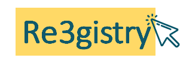

# Re3gistry software & Register Federation Tool

## Re3gistry

### About the Re3gistry

&copy; 2020-2024 European Union. Licensed under the EUPL.

The Re3gistry software is a reusable open-source solution for **managing and sharing ‘reference codes’** through persistent URIs, ensuring that concepts are unambiguously referenced in any domain.

> Reference codes can be sets of permissible values for a data field or to provide a reference or context for the data being exchanged between applications. Reference codes include enumerations, controlled vocabularies, taxonomies, thesauri or, simply, ‘lists of things’.

Licensed under the **[EUPL](http://ec.europa.eu/idabc/eupl.html)**, Re3gistry is an open-source project that can be deployed and further developed by contributors from any sector; check out the Re3gistry Governance and contribution guidelines below.
A license copy is available in the repository's [LICENSE](https://github.com/ec-jrc/re3gistry/blob/master/LICENSE) file.

### What Re3gistry offers you?

> The Re3gistry provides a central access point where labels and descriptions for reference codes are easily accessible by both humans and machines while fostering **semantic interoperability across organisations**.

Managing reference codes and setting up registries (systems of registers) helps:

* **Avoiding common mistakes** such as misspellings, entering synonyms, or filling out online forms.
* **Facilitating the internationalisation of user interfaces** by providing multilingual labels.
* **Ensuring semantic interoperability** when exchanging data between systems and applications.
* **Tracing changes over time** through a well-documented versioning system.
* **Increasing the value of the reference codes**, if widely reused and referenced

> Check out the **[Re3gistry promotional video](https://youtu.be/6Y_KAhibGas?si=uGkaXRJmFUiGv_5C)** and **[Re3gistry demo playlist](https://www.youtube.com/watch?v=Nm4kWxp882M)** for a taster of the software's functionalities.

### Re3gistry features

* Ready-to-use & customisable interface interface​ 
* Intuitive editing interface
* RESTful API
* Built-in [ISO 19135](https://www.iso.org/standard/54721.html) Reference codes management workflow
* Multi-lingual content support
* Automatic versioning
* Highly flexible and customisable data models - Formats available: HTML, ISO 19135 XML, JSON, RDF/XML, Re3gistry XML, CSV 
* Bulk import functionality
* SOLR indexing and search engine
* Installation wizard, including migration support from [Re3gistry 1.3.X](https://joinup.ec.europa.eu/collection/are3na/solution/re3gistry/releases) instances
* Different authentication systems supported 
* Support of externally governed items referenced through URI 
* Support for register federation tool (RoR) with .ror files provision
* User, Administrator and Developer guides

> The Re3gistry software version numbers comply with the [Semantic Versioning Specification 2.0.0](http://semver.org/spec/v2.0.0.html).

### Documentation

* [User manual](documentation/user-manual.md)
* [Administrator manual](documentation/administrator-manual.md)
* [Developer manual](documentation/developer-manual.md)

### Acknowledgements

> The development of the Re3gistry began in 2013 under the [Are3na action](https://joinup.ec.europa.eu/collection/are3na/about) (ISA Programme), continuing since 2016 under the [ELISE action](https://joinup.ec.europa.eu/collection/elise-european-location-interoperability-solutions-e-government/about) of the [ISA2 Programme](https://ec.europa.eu/isa2/isa2_en/). Starting in 2022, the **[Digital Europe Programme](https://digital-strategy.ec.europa.eu/en/activities/digital-programme)** is funding its development.

Version 2 of the software was developed with the [National Land Survey of Finland](https://www.maanmittauslaitos.fi/en).

## Register Federation Tool

### About the Register Federation Tool

&copy; 2020-2024 European Union. Licensed under the EUPL.

Within this repository, you will also find the [**Register-Federation-Tool**](https://github.com/ec-jrc/re3gistry/tree/master/sources/Registry-Federation-Tool).

This tool allows you to **gather external records from third parties in one place**. It also allows you to search across subscribed registers and find extensibility relationships between them. The tool, therefore, takes advantage of the reuse of existing semantic resources, reducing data redundancy and avoiding copying errors.

> Register interconnection is possible by connecting registers that implement the ROR data exchange specification. Re3gistry produces this exchange format automatically between its export formats.

The European Commission Joint Research Center developed the Register Federation Tool as a testbed funded by the ISA Action 1.17 "ARE3NA" to test the feasibility of creating and declaring code list extensions that accommodate specific semantic needs while guaranteeing interoperability of the systems that use them.
Since then, the European Commission has operated the [**INSPIRE federated registry**] (https://inspire.ec.europa.eu/register-federation/) to publish extensions to the INSPIRE code lists used in national and thematic contexts. This favours flexibility and the satisfaction of specific needs, guaranteeing the general interoperability of the INSPIRE spatial data infrastructure.

**However, this tool can be used in any domain that uses semantic assets, so it is freely distributed as an open source for anyone who needs to cover this gap.**

### Documentation
* [RoR descriptor file](sources/Registry-Federation-Tool/documentation/administrator-manual.md)
* [Installation manual](sources/Registry-Federation-Tool/documentation/installation-manual.md)

# Stay tuned
Join [this repository](https://github.com/ec-jrc/re3gistry) and subscribe to notifications.

> Get [registered and subscribe](https://joinup.ec.europa.eu/collection/are3na/solution/re3gistry/authenticate-to-join) to the [Re3gistry solution](https://joinup.ec.europa.eu/collection/are3na/solution/re3gistry/about) in Joinup to get all updates about the software.

## Re3gistry survey
There is available a [Re3gistry survey](https://ec.europa.eu/eusurvey/runner/Re3gistry_Survey). Please complete it and let us know your opinion.

# Re3gistry governance and Contributions (Under development)

The Re3gistry project has established a governance model with well-defined processes to ensure the best use and sustainability of the software by the contributors and the community. The governance is overseen by the Re3gistry managers.

## Project boards

* **Improvement Proposal** (IP)
    * If you want to discuss an idea before documenting a full IP, create a new issue using the [IP template](https://github.com/ec-jrc/re3gistry/issues/new?assignees=&labels=&template=re3gistry-improvement-proposal.md). Complete the template as much as possible and mention that this is not a complete proposal yet, but that you are looking for feedback. You will be asked to complete the proposal if the idea is supported.
   
* **Bug fixing**
    * If you would like to submit a bug report, please create a new issue in the Re3gistry repository using the [Bug report template](https://github.com/ec-jrc/re3gistry/issues/new?assignees=&labels=&template=re3gistry-problem.md). The issue will be analysed and added to the bug fixing project board. If the development team needs more information, you might be contacted.
    * The project board will be updated whenever the status of an issue changes.
    * Pull requests for bug fixes are welcome (see more in "Contribution" below)!

## Contributions

Re3gistry welcomes contributions from everyone; please read carefully the [contribution guidelines](contribution.md) and follow our [Code of Conduct](https://github.com/ec-jrc/re3gistry/blob/master/CODE_OF_CONDUCT.adoc).

## Release plan
Check out the [Re3gistry release plan](https://github.com/ec-jrc/re3gistry/tree/master/release-strategy) for 2022-2024.

