# User manual

## Scope

This manual is aimed at any user using an instance of the Re3gistry software to manage and publish reference codes.

The following documentation focuses on how to make use of the Re3gistry software. If you would like information on installing or configuring the software, please refer to the [Administrator documentation](administrator-manual.md).

This is a live document; it is under continuous improvement. To get the latest version, please visit https://github.com/ec-jrc/re3gistry.

Please report any issue or feedback related to the documentation in the dedicated [GitHub issue tracker](https://github.com/ec-jrc/re3gistry/issues).

## Overview

### What is the Re3gistry

The Re3gistry is a reusable open-source solution for managing and sharing "reference codes".

It provides a consistent central access point where labels and descriptions for reference codes can be easily browsed by humans and retrieved by machines.

Reference codes are exchanged between applications to reference some 'thing uniquely'. They can be used to define sets of permissible values for a data field or to provide a reference or context for the data being exchanged. Examples are enumerations, controlled vocabularies, taxonomies, thesauri or, simply, 'lists of things'.

The Re3gistry supports organisations in managing and updating reference codes consistently. 

### Features and capabilities

* User-friendly editing interface to add, edit and manage the registers and reference codes easily
* Management of the full lifecycle of the reference codes (based on the ISO 19135 Standard)
* Highly flexible and customisable data models
* Multi-lingual content support
* Support for versioning
* RESTful API with content negotiation (including OpenAPI 3 descriptor)
* Free-text search
* Supported formats: HTML, ISO 19135 XML, JSON, RDF/XML, ATOM, Re3gistry XML, CSV, ROR
* Service formats can be easily added or customised
* Multiple authentication options
* Externally governed items referenced through URI 
* INSPIRE register federation format support (option to create the RoR format automatically)
* Web app to access the reference codes in a human-readable way.

### License

The Re3gistry is released under the [European Union Public License - EUPL v.1.2](../LICENSE).

### Acknowledgments

The development of the Re3gistry began in 2013 under the Are3na action (ISA Programme), continuing since 2016 under the [ELISE action](https://joinup.ec.europa.eu/collection/elise-european-location-interoperability-solutions-e-government/elise-re3gistry-software) of the ISA2 Programme. Starting in 2022, the [Digital Europe Programme](https://digital-strategy.ec.europa.eu/en/activities/digital-programme) is funding its development.

## Introduction to the Re3gistry

The Re3gistry editing interface allows managing the complete life-cycle of reference codes, such as the code lists graphically, enumerations controlled vocabularies, taxonomies, thesauri or, simply, 'list of things'.

The actions available to the user are reflected in the menu structure. 

Depending on the type of user account, the user may see different tabs in the menu.

The common tabs available to any users are:
* Home: page showing an overview of the last actions performed
* Content: page allowing  interacting and operating with the content

Details for each menu item are provided in the following sections.

## Simplified workflow

If the simplified workflow has been chosen during the installation, the only role available is *Registry Manager*. This workflow will simplify the steps mentioned in the following sections. There will be no need to process the data through all the different roles; all actions will appear directly in the Registry manager tab.

## Users, roles and groups

The Re3gistry follows the [ISO 19135 Standard "Geographic information — Procedures for item registration"](https://www.iso.org/standard/54721.html).

The possible user roles that re3gistry manages are:

* Registry manager
* Register owner
* Register manager
* Control body 
* Submitting organisations

The system is highly flexible in managing the **roles** since it does not assign the role directly to the **user**. Instead, the user is assigned to one or more **groups**. Then, this group is associated with one or more **registers**, specifying the role of each group. This means that a group can have different roles on different registers. Each user in the system can be associated with one or more groups. 

An example of roles and group assignments is provided in the following box.
---

**Groups**

* Organisation A
* Organisation B
* Organisation C
* Organisation D
* Organisation E

**Registers**

* Vegetables
* Fruits
* Animals

**Mapping**

| Register | Register owner | Register manager | Control body | Submitting organisation |
|---|---|---|---|---|
| Vegetables | Organisation A | Organisation A  | Organisation B | Organisation D |
| Fruits | Organisation E | Organisation A  | Organisation C | Organisation B, Organisation D |
| Animals | Organisation C | Organisation D  | Organisation E | Organisation A |

---

### Registry manager

It is an organisation or a person responsible for the day-to-day management of the registry.

The registry manager has the highest privileges in the system. 
This role can perform three different tasks:

*  make any action on the reference codes. The changes to the reference codes need to undergo the approval workflow by obtaining approval from the **control body**.

* manage the structural elements of the system. He can change and edit information related to the registry and the registers, add new registers, and manage the fields of the registry, registers, and reference codes. These structural changes do not need to have an approval workflow.
* manage both users and groups.

### Register owner

It is an organisation establishing its own register.

In the Re3gistry software, the *register owner* can access the reference code management system to see the actions performed on the registers. 

It is a "formal" role, often controlled by users granted the register manager role.

### Register manager

It is a person or an organisation delegated by the register owner to manage a register.

In the Re3gistry 2 software, the register manager can use the interface to verify and publish the changes once approved by the **control body**.

### Control body

It is a technical expert or group deciding on a register's content. At least one user with the control body role shall be available in the system to approve the changes to apply to the reference codes.

The control body can use the interface provided by the Re3gistry 2 software to:

* Check the changes proposed by the **submitting organisations** and
* to decide how to proceed through the following available actions: approve, reject or approve with changes request.

### Submitting organisation

It is an organisation authorised by the **register owner** to propose changes to the content of a register.

In the Re3gistry software, the submitting organisations can use the editing interface:

* to propose changes to existing reference codes
* to propose the addition of new codes
* to change the status of the reference codes.

The submitting organisations can only propose changes at the reference codes level. Only the **registry manager**, as overall administrator, can act at the registry and register level.

Any action performed by a submitting organisation re

## Status of a reference code

A reference code can pass through different statuses. The type of status may depend on the following:

* The approval management workflow or on
* The life cycle of the reference code itself.

The workflow and possible status types for managing change proposals are available below.

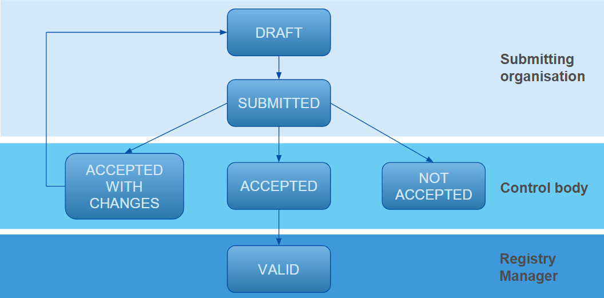

The workflow and possible status types related to the reference code once it becomes "valid" are available below.

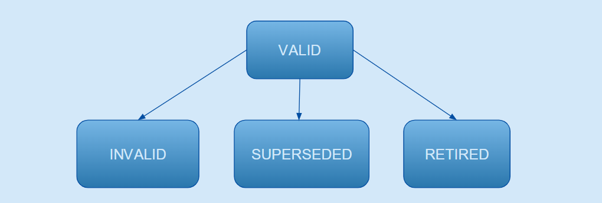

Detailed information on each possible status is available in the next paragraphs.

### Draft

A reference code is in "draft" status when a **change** is proposed by a **submitting organisation** but has not yet been submitted to the **control body**.

Items in draft status can only be edited by the user who started the change proposal.

### Submitted

A reference code is in "submitted" status when the user edits and submits the proposed changes to the **control body** for approval.

Items with "submitted" status cannot be edited anymore.

### Accepted

A reference code enters the "accepted" status once the **control body** accepts the changes formerly submitted by the **submitting organisation(s)**.

### Not accepted

If the **control body** decides that the proposed changes are not acceptable, the status of the reference code becomes **"not accepted"**. If this is the case, the reference code lifecycle finalises, and therefore it cannot be edited any more.

### Valid
After the acceptance of the control body, the status of the reference code becomes “valid”.  The reference code is recommended for use.

### Invalid
If the control body considers a substantial error on a "valid" reference code, a previously valid reference code contains a substantial error and can turn it into "invalid". Generally, an "invalid" reference code is replaced by a new "valid" reference code.

### Superseded
The reference code has been superseded by a new or a different "valid" reference code; therefore, its use is no longer recommended.

### Retired
When a reference code is no longer recommended for use and no supersession is envisaged, the status can be changed to "retired".

## Functionalities

This section provides detailed information on the functionalities available in the Re3gistry user interface, illustrated by screenshots.

### Content editing and browsing section

The content tab is the main part of the system. It allows browsing and editing any registers and reference codes in the system.

The **browsing feature** is available for all the user roles. In contrast, the editing feature is only available for "submitting organisations" and "registry manager".

Check next which are the available editing functionalities by user role.

#### Submitting organisations

To be able to edit and manage the reference codes contained in a register, the user shall be associated with a **group** set as **"submitting organisation"** for that specific register.

In the next image are shown on the left the list of **roles** and on the right, the **group** assigned to each role for that specific register, in the example being "INSPIRE code list register". The group with the "Submitting organisation" role in this case is "Example submitting organisation". 

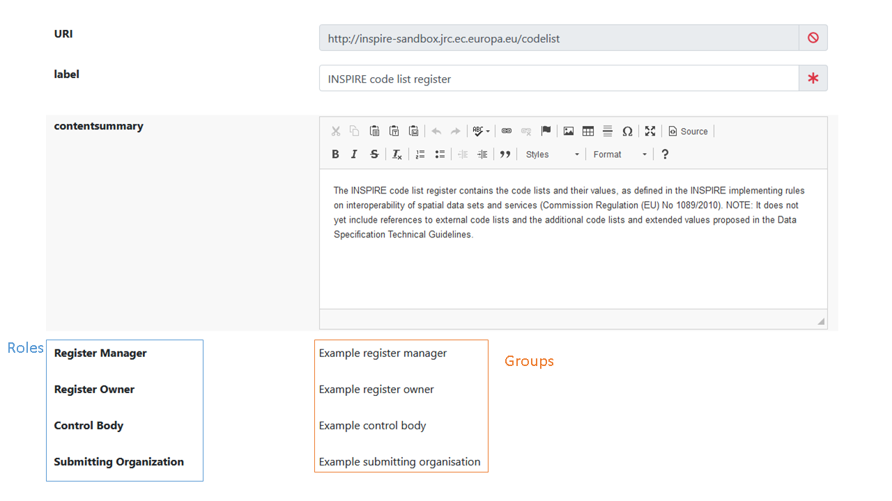

The actions available for the "submitting organisation" role are listed below.

##### Edit/change the existing reference codes 

The change of an existing reference code is done directly using the **input box** available in the interface. After performing a change, the interface switches to a **two-column layout** to highlight better the changes: the proposed changes appear on the left column while the original values are shown on the right column. The use of a yellow background also underlines the differences between both versions.

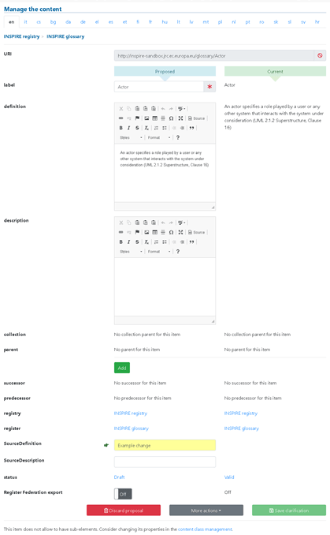

##### Register federation export

The editing interface also provides a flag to allow the system to expose the reference code in the RoR format. In this way, it can eventually be imported into the [INSPIRE register federation](https://inspire-regadmin.jrc.ec.europa.eu/ror/).

##### Add new reference codes

To propose adding a new reference code in a specific register, click the "Add item" button in the interface. A page containing the predefined structure of the siblings' reference codes will show up with the empty fields to be completed.

##### Change the status of a reference code

The dropdown menu "More actions" at the bottom of the page allows one to propose the change of status of a reference code. The possible options are three:
    
* **Invalidate** a reference code specifying the successor
* **Supersede** a reference code specifying the successor
* **Retire** a reference code.

#### Registry manager

The users with the "registry manager" role can use this interface to edit the **Registry** information and add **new registers**.

##### Edit registry information

A user with the registry manager role can uniquely modify the registry-related information. **These changes do not need to undergo the change proposal workflow**.

##### Add a new register

To add a new register, click "Add register". A new page will appear, asking to complete the information fields of the new register. A first list of standard fields will be associated with the recently created register. To add fields or customise pre-existing ones, please look at the **structure** related information, explained later in this manual.

Adding a new register within the registry can uniquely be done by a user with the registry manager role. These changes do not need to undergo the change proposal workflow.

### Structure and data model management

The **structure** tab gives the user access to the data model management for each **entity** in the registry system by graphically adding and managing the fields and their properties.

This section is accessible only to the **registry manager**.

The main page of the structure tab contains the list of **content classes** available in the system.

A content class is automatically created every time a new register is created or added in the **content** tab.

The content classes help shape the "data model" of the entities available in the system. For instance, they help define each of the **fields** available for a reference code; the same mechanism is used to define the fields related to a register or even the registry itself. 

By managing the content class details it is possible to:
* set the order of the fields to be displayed in the user interface,
* select which fields should be visible or hidden and
* manage other properties related to that field.

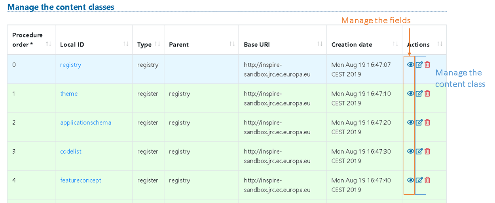

When clicking on the name of the content class or the "eye" icon, the **fields' management** page opens, showing the list of associated fields to the selected **content class**.

Check next the actions available for the field management pages.

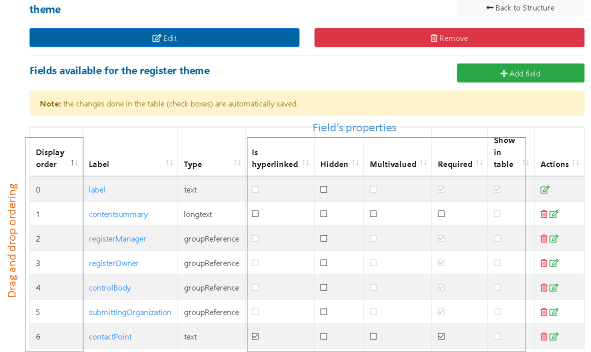

The **field management** page shows all the fields currently available for the selected content class. 

#### Ordering a field

The first column of the table, "Display order", is responsible for managing the order in which to place a field. The user can easily reorder each field by using the drag-and-drop feature. 

The order set here will be reflected in the editing interface and the public web application.

#### Fields label

The label of the field can easily be modified. Additionally, it can be translated into any of the languages available in the system.

#### Properties of the fields

The fields' table allows customising different properties for each field.

##### Is hyperlinked

By checking this box, the system will know that the field has to be hyperlinked. If checked, two fields will be requested to be completed: the label and the URL.

This property is only available for the fields of type **text** or **long text** (except the label that cannot have links).

##### Hidden

This property, if checked, hides the field in the public interface. This property is useful if information related to a reference code (or a register/registry) needs to be stored but kept private.

Note that even when active, the field is displayed in the editing interface.

##### Multivalued

When checked, this property allows having more than one value for the same field.

##### Required

This property defines if the field shall be mandatory or not. When checked, the related fields shall be completed.

##### Show in table

This property allows defining if the field shall be visible in the overview table containing the collection of reference codes.

This property is not available for registers and the registry.

#### Adding a new field

For each **content class**, there is the possibility to define additional fields. The interface for adding new fields allows choosing between two options: **use an already defined field** or **create a new one**.

##### Use an existing field

All the fields created in the system for a specific entity (reference code, register, registry) can be reused by other entities. For example, if a "description" field is created for register x, it can then be reused for register y without creating a new one from scratch.

To this purpose, in the "Add field" page, the user can select any of the fields available from a list and reuse them in the selected **content class**.

If the field is unavailable in the list, the user can still create using the next option, "**Create a new field**".

##### Create a new field

To create a new field, the system will ask to fill in some required information:

* The first one is a **unique identifier** for that field, the **Local ID**
* The label of the field in the master language is requested.
* The type from a dropdown list.

The types of fields are explained below.

##### Text

A simple text with a maximum of 1024 characters.

##### Long text

A long text, in case the length of the text to be inserted is greater than 1024 characters.

##### Date

The date field will display a date picker in the editing interface a.

##### Number

The number value will allow only numeric values.

##### Relation reference

This is a particular field type that allows defining relations between entities contained in the system. Using this field type, the user can link a reference code in a register x that points to another reference code from a register y.

When the relation reference type is selected, the system will ask to match the content class of the entity that needs to be pointed.

##### Date creation and Date edit 

The system automatically calculates these two content types to determine the creation date or update date.

These fields provide metadata information on the reference code management that often are useful to be shown in the public interface.

### Submitting organisation tab

The submitting organisation tan contains the details of the actions done by users of the submitting organisation role.

The actions of proposed changes are grouped by the register.

A submitting organisation user can discard the proposal unless this has already been submitted to the control body. If the "**discard**" button is clicked, a confirmation will be asked to the user.

The actions available on this page are submitting the proposed changes to the **control body** for approval or discarding all changes done.

By entering the details of one specific listed action, the user can also discard changes at the item level.

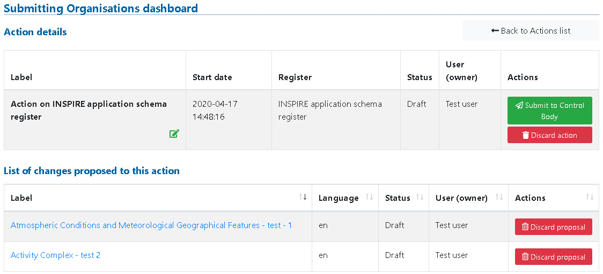

When a user decides to submit the action, a dialogue window to insert optional details such as: 

* A **change log** that can eventually be visible in the public front-end
* A **link** to an issue related to this change tracked in an **issue tracker**

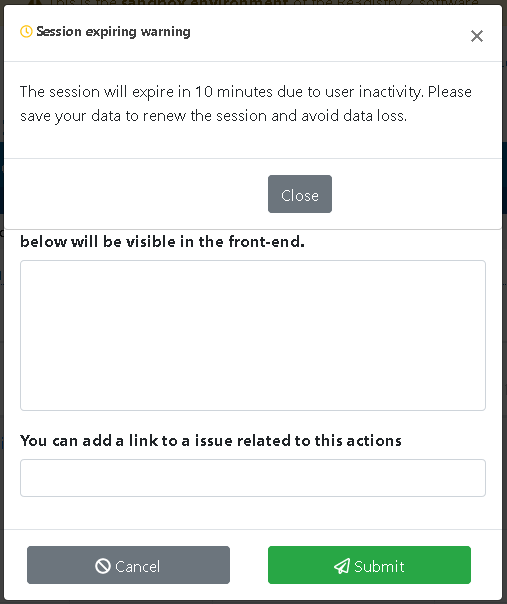

Once an action has been submitted to the **control body**, the changes cannot be edited any more.

### Control body tab

The control body tab contains the details of all the actions done in the relevant registers.

The current user shall be part of a group assigned to the register with the role control body to see the actions. 

As for the submitting organisations, these actions are grouped by register. This means that if there are changes in 2 different registers, these changes will be grouped into 2 different actions. 

The available options are 3 and are listed below.

#### Accept

With this action, the **control body** accepts all the changes contained in that action. After the approval, the next step is the publication of the changes by either the **register manager** or **registry manager**. 

#### Accept with changes

In this case, the **control body** is required to make changes to accept the proposal. 

In this case, the control body has to describe the requested changes in a dialogue that will appear after pressing the "**Accept with changes**" button.

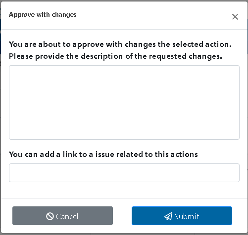

Once an action has been **accepted with changes**, it returns to the draft status so that the **submitting organisation** can read and implement the requested changes. After performing the requested modification, the submitting organisation needs to submit the changes again to the control body for a new review.

If the submitting organisation does not want to implement the changes, there is the possibility to discard all the changes proposed.

#### Reject changes

The **control body** can reject the proposals received by a submitting organisation if deemed so; in this case, a justification should be written in the prompted window.

### Register manager tab

The register manager tab contains the list of actions proposed, grouped by registers.

To see these actions, the user shall be part of a group assigned to the register with the role of **register manager**.

The single available option is the publication of the changes previously accepted by the control body. 

The publication action triggers the change of status of each of the reference codes involved in the changes passing from “**accepted**” to “**valid**“ and making the changes publicly visible (e.g. public website, APIs).

### Registry manager

As the **register manager**, the **registry manager** can publish the changes accepted by the **control body**.

However, the registry manager can additionally:

* manage users and groups and
* manage the data export functionality.

See more details on these actions next.

### Users

The user sub-tab presents a view of all active users in the system. 
The registry manager can edit the information related to each user, including their mapping with **groups**, and add new users.

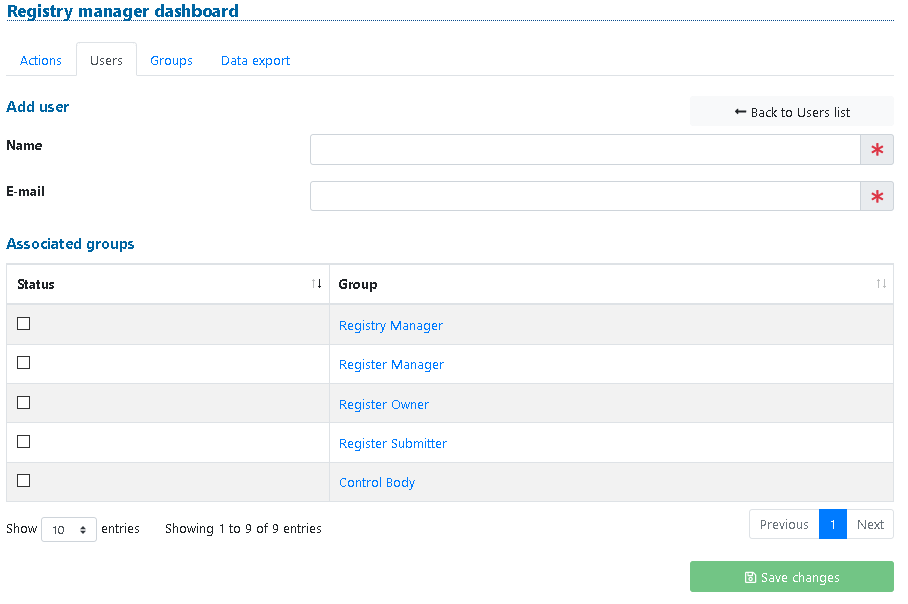

The user can be "**disabled** but not deleted. All the users are kept to have a traceable history of the registered items. However, if a user is deactivated, he cannot log in to the system.

### Groups

The group subtab presents an overview of all the active groups in the system. The registry manager can edit the information related to each group, and the registry manager can also add new groups.

In the group detail page, apart from editing, group-related information can be checked the list of belonging to that group.

### Data export

The Data export subtab allows the registry manager to run a complete SOLR index and a complete CACHE of the items presented in the system.

SOLR: This option helps to easily run a full export of the registry data to the Solr index on the published items.

CACHE: 
* Button "Cache all - Master language": This option helps to run a full cache of the master language of the system.
* Button "Cache all": This option helps to run a full cache of the active languages of the system.
* Button "Remove cache": This option helps to remove the index of all the cache items.

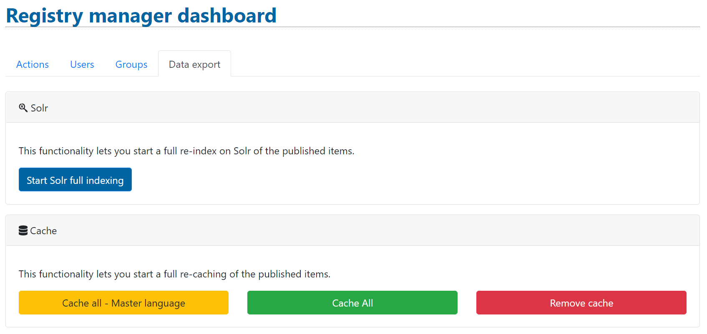

### User profile

The user can manage his details on his/her profile page. To access this section, the button is at the right side of the menu with the user's name logged in.

Depending on the type of installation, using an external authentication provider or the default one, the user could be able to update the name displayed in the system and change the password.

### Email notifications

Users can receive different email notifications to inform them about statuses and actions done to the items and actions they have taken part in. These notifications indicate the status of the items (Items been submitted, published etc.) and some of the actions done in the instance, such as permissions and roles given to a user.

### Bulk Edit

This feature allows the user to make modifications to multiple existing items.
These massive modifications are made using the bulk import tool:

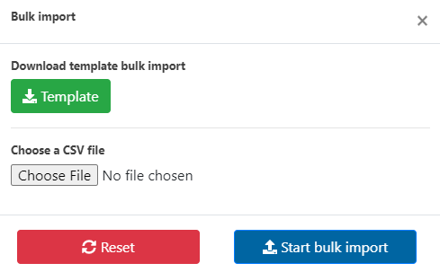

The edition process starts by loading a .csv file containing the specific fields to be modified.
Within this file, it is mandatory to enter the ID of the item and the language. Fields that remain unchanged should be left blank.

When clicking on the "Start bulk import" button, the automated process starts and the items will be updated.

In the available items table the modified items will be displayed in the table with Valid/Draft status.

## Additional Notes

### Default Language
If the default language set in the browser is not available, it will automatically change the re3gistry language to the master language on the running instance.
